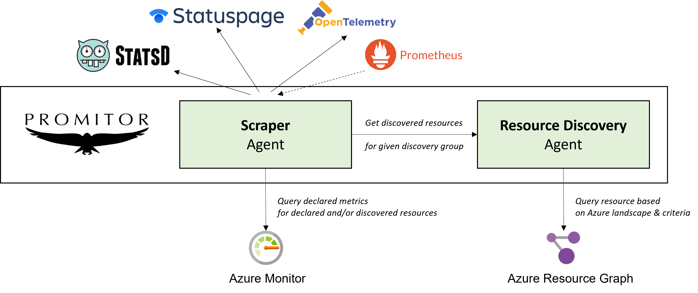

# Overview

Resource discovery allows you to define criteria to automatically discover resources in your Azure tenant and scrape metrics for all of the Azure resources that are found.

## How it works

While Promitor Scraper uses a declarative approach for defining Azure resources to scrape; as of Promitor Scraper 2.0 you can integrate with **Promitor Resource Discovery**!

With resource discovery, you can define **resource discovery groups** that represent Azure resources of a given type and optionally define criteria for the resources to comply with.

By doing this, you can **change your metric declaration for Promitor Scraper so that,** instead of using declared resources, **reference a resource discovery group** which be used to determine what Azure resources it should scrape metrics for.

Behind the scenes, Promitor Resource Discovery integrates with **Azure Resource Graph** which will query your Azure landscape to discover the corresponding resources.

Here's an overview of how they work together:

