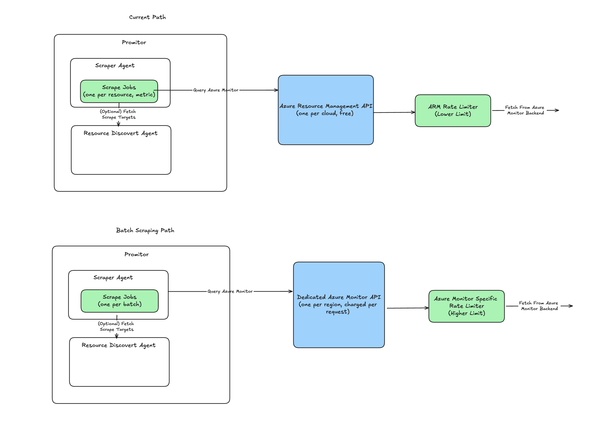

# Using Batch Scraping with Azure Monitor API (Experimental)

Using batch scraping mode, Promitor will fetch resource metrics in batches by using the Azure Monitor data-plane API instead of Azure Resource Manager (ARM) to remove throttling.

> ⚠️ **The Azure Monitor data-plane API is not free, learn more [in the official pricing documentation](https://azure.microsoft.com/pricing/details/monitor/)**.

Promitor deployments are able to monitor a greater set of unique resources and metrics, in part because its requests 
go through dedicated APIs that allow for much greater throughput. However, there are important factors to consider(like cost) when
deploying Promitor this way. 

## Why Do Batch Scraping?
The "traditional" scraping path goes through Azure Resource Management API, which enforces strict [rate limits](https://learn.microsoft.com/en-us/azure/azure-resource-manager/management/request-limits-and-throttling) unsuitable for the throughput needed to monitor large number of resources or metrics. Dedicated APIs for batch scraping aren't subject to the same ARM rate limiting mechanis, and thus allow for much greater throughput. 

Additionally, there may be performance benefits associated with an overall lower number of networks requests. Though this benefit is only hypothetical for now.

## Limitations  
At the present moment, batch scraping can only target resources within the same region. Follow this [issue](https://github.com/tomkerkhove/promitor/issues/2555) for support across multiple regions

Additionally, batch scraping does not work for LogAnalytics resources. Follow this [issue](https://github.com/tomkerkhove/promitor/issues/2556) for 
suppor status. 
 
## Cost Considerations 
Query Costs for metrics and logs are laid out [here](https://azure.microsoft.com/pricing/details/monitor/#pricing). To estimate amount of Azure Monitor API requests(queries) a Promitor deployment will make for a length of time `L`, one can use the formula 

$$
\small {\# of requests} = \text{number of resources} \times \text{number of metrics} \times \left(\frac{L}{\text{scrape interval * batch size}}\right)
$$

Consider an example deployment that monitors 10 metrics across the same set of 100 resources, with a scrape interval of 5 minutes and configured max batch size of 20. In a given day roughly
100 * 10 * (1440/(5 * 20)) = 14400 requests will be made. The cost for that deployment can then be calculated using Azure Monitor's pricing chart

## How Are Batches Built
Batches are constructed using multiple constraints, such as the Azure Monitor metric within a batch must be the same. An important and configurable parameter is the max batch size. Azure Monitor currently(as of Oct 2024) imposes a max batch size of 50 per request, but users are free to impose an even lower limit. 

## Runtime Configuration
See [Runtime Configuration](runtime-configuration.md) page
